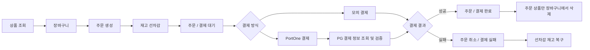
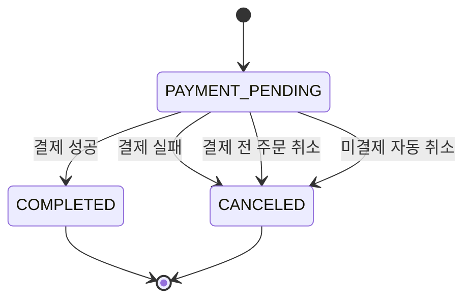
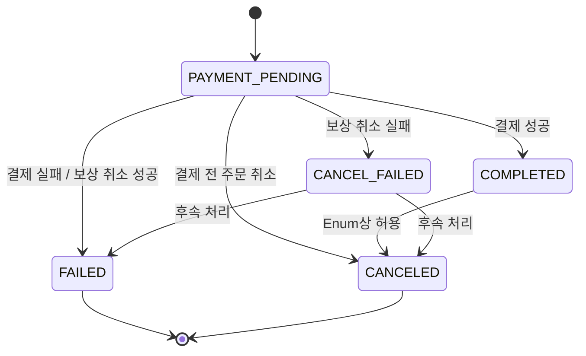
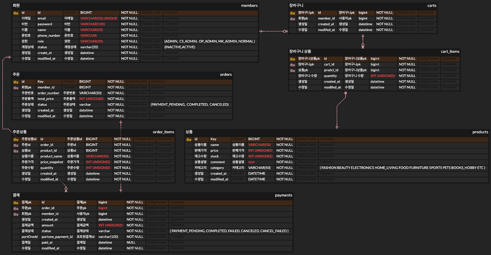

# 🛒 Commerce Plus

> **커머스의 기본 흐름부터 성능 최적화·동시성 제어·실결제 연동까지 단계적으로 확장한 이커머스 백엔드 시스템**

Spring Boot 기반의 이커머스 백엔드 프로젝트입니다.

상품 → 장바구니 → 주문 → 결제 → 취소로 이어지는 커머스의 핵심 흐름을 먼저 완성하고,
그 위에 QueryDSL, 인덱스, 캐시, 동시성 제어를 적용해 실제 성능과 데이터 정합성을 검증했습니다.

이후 PortOne 실결제를 확장하여
**주문·결제·재고가 여러 요청과 실패 상황에서도 일관된 상태를 유지하는 구조**를 구현하는 데 중점을 두었습니다.

---

## 목차

1. [프로젝트 소개](#1-프로젝트-소개)
2. [기술 스택](#2-기술-스택)
3. [핵심 흐름](#3-핵심-흐름)
4. [주요 기능](#4-주요-기능)
5. [ERD](#5-erd)
6. [API 명세](#6-api-명세)
7. [디렉토리 구조](#7-디렉토리-구조)
8. [주요 기술적 구현](#8-주요-기술적-구현)
9. [테스트 및 검증](#9-테스트-및-검증)
10. [협업 방식](#10-협업-방식)
11. [팀 구성 및 기여 내용 (R&R)](#11-팀-구성-및-기여-내용-rr)
12. [하지 않은 것과 그 이유](#12-하지-않은-것과-그-이유)
13. [실행 방법](#13-실행-방법)

---

## 1. 프로젝트 소개

### 프로젝트 배경

본 프로젝트는 상품 → 장바구니 → 주문 → 결제 → 취소로 이어지는
커머스 핵심 흐름을 하나의 시스템으로 구현하고,
재고·주문·결제 상태의 데이터 정합성을 보장하는 것을 목표로 했습니다.

기본 흐름을 먼저 완성한 뒤
QueryDSL, 인덱스, 캐시, 동시성 제어를 적용해 성능과 정합성을 검증하고,
마지막으로 PortOne 실결제를 연동해 외부 결제까지 확장했습니다.

### 프로젝트 목표

#### 🌱 커머스 기본 흐름 구현

- Spring Security와 JWT 기반 인증·인가
- 로그인 회원 기준 리소스 소유권 검증
- 상품 조건 검색 및 페이지네이션
- 장바구니 상품 추가·수량 변경·삭제
- 동일 상품 추가 시 수량 합산
- 주문 생성 시 재고 검증 및 선차감
- 주문 시점의 상품명·가격 스냅샷 저장
- 주문 생성과 결제 대기 데이터 생성
- 모의 결제 성공·실패 처리
- 결제 실패 및 주문 취소 시 재고 복구
- 주문·결제 상태 전이 관리

#### ⚙️ 핵심 기술 적용 및 측정

- QueryDSL 기반 동적 쿼리 구현
- 대량 데이터 환경에서 인덱스 적용 전·후 비교
- `EXPLAIN`을 통한 실행 계획 분석
- Caffeine 로컬 캐시 적용 및 응답 성능 비교
- 상품 정보 변경 시 캐시 무효화
- 비관적 락을 이용한 재고 동시성 제어
- 상품 ID 정렬을 통한 데드락 발생 가능성 감소
- 동시 주문 테스트를 통한 재고 정합성 검증

#### 🚀 확장 기능

- PortOne 실결제 연동
- 서버 저장 금액과 PG 결제 금액 재검증
- 외부 결제 성공 후 내부 처리 실패 시 보상 취소
- 일정 시간 동안 결제가 완료되지 않은 주문 자동 취소
- Docker 기반 애플리케이션·MySQL 실행 환경 구성

---
## 2. 기술 스택

| 구분 | 기술 |
| --- | --- |
| Language | Java 21 |
| Framework | Spring Boot 4.1.1, Spring MVC |
| Persistence | Spring Data JPA, Hibernate |
| Query | QueryDSL 6.10.1 (OpenFeign fork) |
| Authentication / Security | Spring Security, JWT (JJWT 0.12.6), BCrypt |
| Validation | Bean Validation |
| Database | MySQL 8.0 |
| Cache | Spring Cache, Caffeine |
| Payment | PortOne Server SDK 0.23.0 |
| Configuration | AWS Parameter Store |
| Monitoring | Spring Boot Actuator |
| Build | Gradle |
| Container | Docker, Docker Compose |
| Utility | Lombok |
| Collaboration | Git, GitHub, GitHub Pull Request |

### 주요 기술 선택

- **Spring Data JPA**
  - 회원, 장바구니, 주문, 결제 등 핵심 도메인의 영속성 관리

- **QueryDSL**
  - 카테고리, 가격 등 여러 검색 조건을 조합하는 동적 쿼리 구현
  - 문자열 기반 JPQL 대신 타입 세이프한 조회 조건 구성

- **Caffeine Cache**
  - 반복적으로 조회되는 상품 데이터를 로컬 캐시에 저장
  - 캐시 적용 전·후 응답 시간을 측정하고 상품 수정 시 캐시를 무효화

- **MySQL + Pessimistic Lock**
  - 재고 차감·복구 시 DB 비관적 락을 적용해 동시 요청에서 재고 정합성 보장
  - 다중 상품 주문 시 상품 ID를 정렬하여 락 획득 순서를 통일

- **PortOne**
  - 모의 결제 흐름을 완성한 뒤 실제 결제 조회·검증·취소 기능으로 확장
  - 서버에 저장된 결제 금액과 PG 결제 금액을 재검증

- **Docker / Docker Compose**
  - Spring Boot 애플리케이션과 MySQL 실행 환경을 컨테이너로 구성

- **AWS Parameter Store**
  - 운영 환경의 설정값을 애플리케이션 코드와 분리하여 외부에서 주입
  - `optional` 설정을 사용해 Parameter Store를 사용할 수 없는 로컬 환경에서는 환경변수로 대체 가능

- **Spring Boot Actuator**
  - 애플리케이션 헬스 상태 확인을 위한 `/actuator/health` 엔드포인트 제공

---
## 3. 핵심 흐름

Commerce Plus의 핵심 비즈니스 흐름은 다음과 같습니다.

**상품 조회 → 장바구니 → 주문 생성 → 결제 → 완료 또는 취소**

주문 생성 시점에 재고를 먼저 확보하고,
결제 결과에 따라 주문·결제 상태와 재고를 함께 변경하는 구조로 설계했습니다.

---

### 3.1 전체 서비스 흐름



주문 생성 단계에서는 결제 완료 여부와 관계없이 재고를 먼저 선차감하여
주문에 필요한 상품 수량을 확보합니다.

결제가 성공하면 주문과 결제를 완료 상태로 변경하고,
이번 주문에 포함된 상품만 장바구니에서 삭제합니다.

결제가 실패하면 주문 생성 시 선차감한 재고를 복구하고,
장바구니는 그대로 유지합니다.

---

### 3.2 주문 생성과 재고 선차감

```text
장바구니 상품 선택
        ↓
로그인 회원 및 장바구니 검증
        ↓
선택한 CartItem 검증
        ↓
상품 ID 기준 오름차순 정렬
        ↓
상품 비관적 락 획득
        ↓
재고 검증 및 선차감
        ↓
OrderItem 생성
- 상품명 스냅샷
- 가격 스냅샷
- 주문 수량
        ↓
주문 총액 계산
        ↓
Order 생성
PAYMENT_PENDING
        ↓
Payment 사전 생성
PAYMENT_PENDING
```

주문 생성 시 결제 완료 이후 재고를 차감하는 것이 아니라,
**주문 시점에 재고를 선차감**합니다.

여러 상품을 동시에 주문하는 경우 상품 ID를 기준으로 오름차순 정렬한 뒤
동일한 순서로 비관적 락을 획득합니다.

이를 통해 여러 트랜잭션이 서로 다른 순서로 상품 락을 요청하면서 발생할 수 있는
데드락 가능성을 줄였습니다.

`OrderItem`에는 주문 시점의 **상품명과 가격을 스냅샷으로 저장**합니다.

따라서 주문 이후 상품명이나 가격이 변경되어도
기존 주문에는 주문 당시의 상품 정보와 결제 기준 금액이 유지됩니다.

주문 저장과 함께 해당 주문의 `Payment`를 `PAYMENT_PENDING` 상태로 사전 생성합니다.

재고 선차감, 주문 생성, 주문 상품 스냅샷 저장,
결제 대기 데이터 생성은 **하나의 트랜잭션으로 처리**합니다.

따라서 주문 상품 중 재고가 부족한 상품이 하나라도 있거나
주문 생성 과정에서 예외가 발생하면 전체 작업이 롤백됩니다.

---

### 3.3 모의 결제 흐름

외부 PG 호출 없이 서버 내부에서 결제 성공과 실패 흐름을 검증할 수 있도록
모의 결제 기능을 구현했습니다.

#### 결제 성공

```text
모의 결제 요청
        ↓
주문 소유자 검증
        ↓
Order 상태 검증
PAYMENT_PENDING
        ↓
Payment 상태 검증
PAYMENT_PENDING
        ↓
요청 금액과 서버 저장 금액 비교
        ↓
Payment / Order 비관적 락 획득
        ↓
소유자 및 상태 재검증
        ↓
Payment → COMPLETED
paidAt 기록
        ↓
Order → COMPLETED
        ↓
이번 주문에 포함된 상품만
장바구니에서 삭제
```

결제 처리 시 주문 소유자와 주문·결제 상태,
요청 금액과 서버에 저장된 결제 금액을 검증합니다.

실제 상태를 변경하기 직전에는 `Payment`와 `Order`를 비관적 락으로 다시 조회하고
소유자와 상태를 한 번 더 검증합니다.

결제가 성공하면 다음 작업을 하나의 결제 완료 트랜잭션에서 처리합니다.

- `Payment` → `COMPLETED`
- `paidAt` 기록
- `Order` → `COMPLETED`
- 이번 주문에 포함된 상품만 장바구니에서 삭제

재고는 주문 생성 시 이미 선차감되었으므로
**결제 성공 시에는 재고를 다시 차감하지 않습니다.**

#### 결제 실패

```text
모의 결제 요청
        ↓
소유자 / 상태 / 금액 검증
        ↓
Payment / Order 비관적 락 획득
        ↓
소유자 및 상태 재검증
        ↓
Payment → FAILED
        ↓
Order → CANCELED
        ↓
주문 내역에서
상품별 복구 수량 계산
        ↓
선차감 재고 복구
        ↓
장바구니 유지
```

결제가 실패하면 주문 생성 과정에서 선차감했던 재고를 다시 복구합니다.

`Payment → FAILED`, `Order → CANCELED`, 재고 복구를
하나의 트랜잭션에서 처리하여 일부 작업만 반영되는 상황을 방지합니다.

장바구니 상품은 삭제하지 않아 사용자가 다시 주문할 수 있도록 유지합니다.

---

### 3.4 PortOne 실결제 흐름

모의 결제에서 구현한 내부 결제 처리 구조를 기반으로
PortOne 실결제를 확장했습니다.

```text
클라이언트 PortOne 결제
        ↓
서버 결제 확정 요청
        ↓
주문 소유자 검증
        ↓
Order / Payment 상태 검증
        ↓
저장된 PortOne Payment ID 검증
        ↓
PortOne 결제 정보 조회
        ↓
PG 결제 ID 검증
        ↓
PG 상태 = PAID 검증
        ↓
PG 결제 금액
=
서버 저장 결제 금액 검증
        ↓
Payment / Order 비관적 락 획득
        ↓
소유자 및 상태 재검증
        ↓
Payment → COMPLETED
Order → COMPLETED
        ↓
주문 상품 장바구니 삭제
```

클라이언트의 결제 성공 결과만 신뢰하지 않고,
서버가 PortOne에서 실제 결제 정보를 다시 조회합니다.

서버에서는 다음 정보를 검증한 뒤 내부 결제를 확정합니다.

- 요청한 PortOne 결제 ID와 서버에 저장된 결제 ID
- PortOne 결제 상태가 `PAID`인지 여부
- PortOne 실제 결제 금액과 서버에 저장된 결제 금액의 일치 여부

외부 PG 검증 이후 내부 데이터를 변경하기 직전에는
`Payment`와 `Order`를 다시 비관적 락으로 조회하여 상태를 재검증합니다.

#### PortOne 결제 검증 또는 내부 처리 실패

PortOne 조회·검증 또는 내부 결제 완료 처리 과정에서 예외가 발생하면
먼저 `Payment`의 최신 상태를 다시 조회합니다.

```text
결제 처리 중 예외 발생
        ↓
Payment 최신 상태 재조회
        ↓
아직 PAYMENT_PENDING 인가?
        │
   ┌────┴────┐
   │         │
  NO        YES
   │         │
   ▼         ▼
이미 다른 요청에서   PortOne 응답이
처리된 최신 결과 반환  실제 PAID 인가?
                    │
               ┌────┴────┐
               │         │
              YES        NO
               │         │
               ▼         ▼
          PortOne      PG 취소 없이
          보상 취소     내부 실패 처리
            시도          │
               │          ▼
          ┌────┴────┐  Payment → FAILED
          │         │  Order → CANCELED
         성공       실패   재고 복구
          │         │
          ▼         ▼
Payment → FAILED   Payment → CANCEL_FAILED
Order → CANCELED   후속 처리 대상
재고 복구
```

예외가 발생했더라도 다른 요청에서 이미 해당 결제를 처리했다면,
중복 상태 변경을 수행하지 않고 최신 결제 결과를 그대로 반환합니다.

PortOne에서는 이미 결제가 완료된 `PAID` 상태인데
내부 결제 확정에 실패한 경우에는 실제 결제와 내부 데이터가 어긋나는 것을 방지하기 위해
**PortOne 보상 취소를 시도**합니다.

보상 취소에 성공하면 내부 데이터를 다음과 같이 정리합니다.

```text
Payment → FAILED
Order → CANCELED
선차감 재고 복구
```

PortOne의 실제 결제 취소 요청까지 실패하면
`Payment`를 `CANCEL_FAILED` 상태로 기록하여 정상적인 결제 실패와 구분하고,
별도의 후속 처리가 필요한 상태로 남깁니다.

PortOne 응답이 없거나 실제 결제가 `PAID` 상태가 아닌 경우에는
외부 PG 취소를 호출하지 않고 내부 실패 처리를 진행합니다.

보상 처리 이후에는 최초 결제 처리 과정에서 발생한 예외를 다시 전달하여
**클라이언트에도 결제 확정 실패로 응답**합니다.

---

### 3.5 결제 전 주문 취소

현재 주문 취소 기능은 **결제 전 `PAYMENT_PENDING` 상태의 주문만 지원**합니다.

```text
주문 취소 요청
        ↓
Order 조회
        ↓
주문 소유자 검증
        ↓
Order 상태 검증
PAYMENT_PENDING
        ↓
Order → CANCELED
        ↓
주문 상품 수량만큼
선차감 재고 복구
        ↓
Payment → CANCELED
```

주문 생성 시 재고를 미리 차감했기 때문에,
결제 전에 사용자가 주문을 취소하면 주문 상품 수량만큼 재고를 복구합니다.

현재 구현에서는 결제 전 주문 취소 시
연결된 `Payment` 역시 `PAYMENT_PENDING → CANCELED`로 변경합니다.

결제가 완료된 `COMPLETED` 주문은 현재 주문 취소 대상이 아닙니다.

따라서 **결제 완료 후 주문 취소 및 사용자 요청에 의한 PortOne 환불 기능은
현재 프로젝트 범위에서 지원하지 않습니다.**

이미 취소되었거나 결제가 완료된 주문에 취소 요청이 들어오면
`Order.cancel()`의 상태 검증에서 차단됩니다.

> PortOne 결제 확정 중 내부 오류로 수행되는 **보상 취소**와
> 사용자가 결제 완료 후 요청하는 **일반 환불**은 서로 다른 흐름입니다.
> 현재 구현된 PortOne 취소는 전자의 보상 처리에 사용됩니다.

---

### 3.6 미결제 주문 자동 취소

주문 생성 시 재고를 선차감하므로,
결제를 진행하지 않은 주문이 계속 남아 있으면 판매 가능한 재고가 불필요하게 점유될 수 있습니다.

이를 방지하기 위해 **주문 생성 후 30분 이상 결제가 완료되지 않은 주문을 자동 취소**합니다.

#### 결제 대기 중 재고 선점

주문이 생성되면 결제 여부와 관계없이
상품 재고가 즉시 주문 수량만큼 감소합니다.

예를 들어 재고가 1개 남은 상품을 사용자 A가 주문하면:

```text
상품 재고 1
    ↓
A 주문 생성
    ↓
상품 재고 0
Order = PAYMENT_PENDING
Payment = PAYMENT_PENDING
```

이 상태에서는 A가 아직 결제를 완료하지 않았더라도
DB에 저장된 판매 가능 재고는 이미 `0`입니다.

따라서 다른 사용자 B가 같은 상품으로 새로운 주문을 생성하려 하면
재고 부족 검증에서 차단됩니다.

즉, 결제 대기 시간 동안에는 해당 주문이 필요한 재고를
**선점하고 있는 구조**입니다.

A가 정상적으로 결제를 완료하면
주문 생성 시 이미 확보한 재고를 사용하므로 재고를 다시 차감하지 않습니다.

반대로 제한 시간 동안 결제를 완료하지 않으면
자동 취소 과정에서 선차감했던 재고를 다시 판매 가능한 재고로 복구합니다.

#### 자동 취소 흐름

```text
스케줄러 1분마다 실행
        ↓
현재 시각 - 30분 계산
        ↓
30분 이상 지난
PAYMENT_PENDING 주문 조회
        ↓
주문별 별도 트랜잭션 시작
REQUIRES_NEW
        ↓
현재도 PAYMENT_PENDING인지 재검증
        ↓
OrderItem을 Product ID 기준 정렬
        ↓
상품 비관적 락 획득
        ↓
선차감 재고 복구
        ↓
Order → CANCELED
```

스케줄러는 1분마다 실행되며,
현재 시각을 기준으로 30분 이상 지난 결제 대기 주문을 조회합니다.

자동 취소 처리 메서드에서는 Order를 조회한 뒤
해당 주문이 여전히 `PAYMENT_PENDING` 상태인지 확인합니다.

재고 복구 시에는 상품 ID 순으로 정렬한 뒤 비관적 락을 획득하여
여러 상품의 락 획득 순서를 일정하게 유지합니다.

또한 각 만료 주문은 `REQUIRES_NEW`를 사용해 별도의 트랜잭션으로 처리합니다.

따라서 하나의 만료 주문 처리에서 예외가 발생하더라도
다른 주문의 자동 취소 처리까지 함께 롤백되지 않도록 구성했습니다.

#### 30분 만료 시점의 동시 처리

자동 취소 로직은 재고를 복구하기 전에
주문이 `PAYMENT_PENDING`인지 확인합니다.

결제 완료 처리 역시 실제 상태를 변경하기 직전에
`Payment`와 `Order`에 비관적 락을 획득하고
두 상태가 모두 `PAYMENT_PENDING`인지 재검증합니다.

다만 현재 자동 취소 처리에서는
`Order` 자체를 비관적 락으로 조회하지 않고
일반 조회를 통해 Order와 OrderItem을 가져옵니다.

따라서 30분 만료 시점에
**동일 주문의 결제 확정과 자동 취소가 동시에 진행되면 처리 순서에 따라 결과가 달라질 수 있습니다.**

##### 자동 취소가 먼저 완료되는 경우

```text
Order = PAYMENT_PENDING
        ↓
자동 취소 실행
        ↓
재고 복구
Order → CANCELED
        ↓
COMMIT
        ↓
결제 확정 요청
        ↓
Payment / Order 비관적 락 획득
        ↓
Order = CANCELED 확인
        ↓
결제 상태 검증 실패
```

이 순서에서는 결제 확정 단계가
이미 `CANCELED` 상태로 변경된 Order를 확인하므로
결제를 완료 처리하지 않습니다.

##### 자동 취소가 Order를 먼저 읽은 뒤 결제 확정이 먼저 완료되는 경우

```text
자동 취소 트랜잭션
Order = PAYMENT_PENDING 조회
        ↓
        │
        ├──── 결제 확정 트랜잭션
        │
        │     Payment / Order 비관적 락 획득
        │             ↓
        │     Payment → COMPLETED
        │     Order → COMPLETED
        │             ↓
        │           COMMIT
        │
        ↓
자동 취소 트랜잭션 계속 실행
        ↓
기존에 읽어둔
Order = PAYMENT_PENDING 상태를 기준으로 처리
        ↓
상품 재고 복구
        ↓
Order.cancel()
        ↓
Order → CANCELED
```

자동 취소 트랜잭션은 이미 메모리에 로딩한
`PAYMENT_PENDING` 상태의 Order를 기준으로 후속 작업을 진행하기 때문에,
그 사이 결제 확정 트랜잭션이 먼저 커밋되어
DB의 주문 상태가 `COMPLETED`가 되었더라도 이를 다시 조회하지 않을 수 있습니다.

이 경우 **결제가 완료된 주문이 `CANCELED` 상태로 덮어써지고,
이미 판매된 상품의 재고가 다시 복구되는 데이터 불일치가 발생할 수 있습니다.**

이 문제는 서로 다른 사용자가 하나 남은 재고를 동시에 구매하는 문제와는 다릅니다.

일반적인 재고 초과 판매는 주문 생성 단계에서
**재고 선차감 + Product 비관적 락**을 적용하여 방지합니다.

현재 남아 있는 경계 조건은
**동일 주문의 결제 확정과 30분 만료 자동 취소가 겹치는 경우**입니다.

이번 프로젝트 범위에서는 해당 로직을 추가 수정하지 않았습니다.

향후에는 자동 취소 처리에서도 먼저 Order 비관적 락을 획득한 뒤
상태를 검증하도록 변경하여
결제 확정과 자동 취소가 동일한 Order 락을 기준으로 순차 처리되도록 개선할 수 있습니다.

구현 시에는 현재 OrderItem 조회 방식과 락 획득 방식을 함께 고려하여
쿼리 및 회귀 테스트를 다시 검증할 필요가 있습니다.

> 현재 자동 취소 로직은 **Order 상태와 재고만 정리**합니다.
> 연결된 `Payment`의 상태는 변경하지 않습니다.
>
> 일반적인 미결제 주문의 경우 `Payment`는 `PAYMENT_PENDING` 상태로 남지만,
> `Order`가 이미 `CANCELED` 상태이므로 이후 결제 요청은
> 주문 상태 검증에서 차단됩니다.
>
> 또한 PortOne 보상 취소에 실패한 `CANCEL_FAILED` 결제의 주문 역시
> `Order`가 `PAYMENT_PENDING` 상태로 남아 있으므로 30분이 지나면 자동 취소 대상이 됩니다.
> 이 경우 **재고는 복구되고 Order는 `CANCELED`가 되지만,
> PG 결제는 남아 있고 Payment는 `CANCEL_FAILED` 상태를 유지**합니다.
>
> 따라서 해당 건은 운영자의 수동 확인 및 후속 처리가 필요합니다.
> 이 내용은 트러블슈팅 및 미구현/한계 항목에서 별도로 다룹니다.

---

### 3.7 주문·결제 상태 전이

#### Order 상태

현재 실제 주문 처리 흐름은 다음과 같습니다.



현재 주문 취소 API는 `Order.cancel()`에서
`PAYMENT_PENDING` 상태만 취소할 수 있도록 제한합니다.

> `OrderStatus` Enum에는 `COMPLETED → CANCELED` 전이가 정의되어 있지만,
> 현재 주문 취소 기능은 결제 전 `PAYMENT_PENDING` 주문만 지원하므로
> 실제 주문 취소 API에서는 해당 전이를 사용하지 않습니다.

#### Payment 상태

`PaymentStatus`에서 `PAYMENT_PENDING`은
**자기 자신을 제외한 모든 Payment 상태로 전이할 수 있습니다.**

```text
PAYMENT_PENDING
├─→ COMPLETED
├─→ FAILED
├─→ CANCELED
└─→ CANCEL_FAILED
```

전체 상태 전이는 다음과 같습니다.



상태별 전이 규칙은 다음과 같습니다.

```text
PAYMENT_PENDING
→ COMPLETED / FAILED / CANCELED / CANCEL_FAILED

COMPLETED
→ CANCELED

CANCEL_FAILED
→ FAILED / CANCELED

FAILED
→ 종료

CANCELED
→ 종료
```

`PaymentStatus`는 허용 가능한 상태 전이를 Enum에서 관리하고,
`Payment` 엔티티는 상태 변경 시 해당 전이가 가능한지 검증합니다.

현재 사용자 주문 취소 기능은 결제 전까지만 지원하기 때문에
`COMPLETED → CANCELED` 전이는 일반적인 사용자 주문 취소 흐름에서는 사용하지 않습니다.

---

### 3.8 주요 상태 조합

| 상황 | Order | Payment | 재고 |
| --- | --- | --- | --- |
| 주문 생성 | `PAYMENT_PENDING` | `PAYMENT_PENDING` | 선차감 |
| 결제 성공 | `COMPLETED` | `COMPLETED` | 선차감 상태 유지 |
| 결제 실패 | `CANCELED` | `FAILED` | 복구 |
| 결제 전 주문 취소 | `CANCELED` | `CANCELED` | 복구 |
| 30분 미결제 자동 취소 | `CANCELED` | `PAYMENT_PENDING` | 복구 |
| PortOne 보상 취소 성공 | `CANCELED` | `FAILED` | 복구 |
| PortOne 보상 취소 실패 직후 | `PAYMENT_PENDING` | `CANCEL_FAILED` | 선차감 상태 유지 |
| `CANCEL_FAILED` 주문 30분 경과 후 | `CANCELED` | `CANCEL_FAILED` | 복구 |

> `CANCEL_FAILED` 상태에서 자동 취소가 수행되면
> 내부 재고는 다시 판매 가능한 상태가 되지만 PG 결제는 여전히 남아 있습니다.
> 따라서 이 상태는 자동으로 종결된 것으로 보지 않고 운영상 후속 처리 대상으로 관리합니다.
>
> 또한 30분 만료 자동 취소와 동일 주문의 결제 확정이 경쟁하는 경우,
> 자동 취소가 락 없이 읽어둔 `PAYMENT_PENDING` 상태를 기준으로 후속 처리를 계속하면
> 이미 결제 완료된 주문을 `CANCELED`로 변경하고 재고를 잘못 복구할 가능성이 있습니다.
> 해당 상황은 정상적인 상태 조합이 아닌 동시성 경계 조건으로 별도 관리합니다.

---

### 3.9 핵심 설계 원칙

| 원칙 | 처리 방식 |
| --- | --- |
| 재고 확보 시점 | 주문 생성 시 선차감 |
| 결제 대기 중 재고 | 선차감된 수량을 해당 주문이 선점하여 다른 주문의 중복 판매 방지 |
| 주문 생성 정합성 | 재고 차감 · 주문 · 스냅샷 · Payment 생성을 단일 트랜잭션으로 처리 |
| 주문 정보 보존 | 상품명·가격을 `OrderItem`에 스냅샷 저장 |
| 다중 상품 주문 | Product ID 순으로 정렬 후 비관적 락 획득 |
| 결제 성공 | 재고 재차감 없이 Order / Payment 완료 |
| 결제 실패 | Order 취소 + Payment 실패 + 재고 복구 |
| 장바구니 처리 | 결제 성공 시 이번 주문 상품만 삭제 |
| 결제 전 주문 취소 | Order / Payment `CANCELED` + 재고 복구 |
| 결제 완료 후 사용자 취소 | 현재 지원하지 않음 |
| Payment 상태 전이 | `PAYMENT_PENDING`에서 `COMPLETED`, `FAILED`, `CANCELED`, `CANCEL_FAILED`로 전이 가능 |
| PortOne 검증 | 결제 ID · 상태 · 실제 결제 금액을 서버에서 재검증 |
| PortOne 보상 처리 | PG 결제 완료 후 내부 처리 실패 시 자동 취소 시도 |
| 동시 결제 방어 | 상태 변경 직전 Order / Payment 락 획득 및 재검증 |
| 장기 미결제 처리 | 30분 초과 주문 자동 취소 및 재고 복구 |
| 만료 경계 동시성 | 자동 취소의 Order 조회에는 락이 없어 결제 확정과 경쟁 시 완료 주문 취소·재고 오복구 가능 → Order 단위 동시성 제어 검토 |
| 보상 취소 실패 | `CANCEL_FAILED`로 분리하여 운영 후속 처리 대상으로 관리 |

---
## 4. 주요 기능

### 4.1 회원 및 인증

- **일반 회원가입**
  - 이메일 중복 여부와 비밀번호 확인값을 검증한 뒤 회원을 생성합니다.

- **관리자 회원가입**
  - 관리자 역할을 지정하여 관리자 계정을 생성할 수 있습니다.

- **로그인**
  - 이메일과 비밀번호를 검증하고 정상 로그인 시 JWT를 발급합니다.

- **JWT 기반 인증**
  - 인증이 필요한 API에서는 JWT에서 로그인 회원 정보를 추출하여 사용자 식별과 권한 검증에 사용합니다.

- **관리자 목록 조회**
  - 활성 상태의 `ADMIN` 권한 사용자만 관리자 목록을 조회할 수 있습니다.

---

### 4.2 상품

- **상품 목록 조회**
  - 카테고리와 가격 범위 등의 조건을 조합하여 상품을 검색합니다.
  - 조회 결과는 페이지네이션으로 제공합니다.

- **캐시 적용 상품 목록 조회**
  - 동일한 검색 결과를 Caffeine 로컬 캐시에 저장하여 반복 조회에 활용합니다.
  - 일반 조회와 캐시 적용 조회를 분리하여 적용 전·후 성능을 비교할 수 있도록 구성했습니다.

- **상품 상세 조회**
  - 상품 ID를 기준으로 단일 상품의 상세 정보를 조회합니다.

- **상품 수정**
  - 관리자 권한으로 상품 정보를 수정할 수 있습니다.
  - 상품 수정 시 기존 상품 검색 캐시를 무효화하여 변경된 데이터가 반영되도록 합니다.

- **대량 상품 데이터 생성**
  - 검색 성능과 인덱스 효과를 검증하기 위한 50,000건의 상품 데이터를 일괄 생성할 수 있습니다.

---

### 4.3 장바구니

- **상품 추가**
  - 로그인 회원의 장바구니에 상품과 수량을 추가합니다.
  - 동일한 상품이 이미 존재하면 새 항목을 생성하지 않고 기존 수량에 합산합니다.
  - 합산된 수량이 상품 재고를 초과하면 요청을 거절합니다.

- **장바구니 조회**
  - 로그인 회원 본인의 장바구니와 상품 목록을 조회합니다.
  - 아직 장바구니가 존재하지 않는 경우 빈 상품 목록을 반환합니다.

- **상품 수량 변경**
  - 본인의 장바구니에 포함된 상품의 수량을 변경합니다.

- **상품 개별 삭제**
  - 본인의 장바구니에서 특정 상품을 삭제합니다.

- **장바구니 전체 삭제**
  - 로그인 회원의 장바구니 상품을 한 번에 삭제합니다.

---

### 4.4 주문

- **주문서 미리보기**
  - 장바구니에서 선택한 상품을 기준으로 주문 상품과 총 주문 금액을 결제 전에 확인할 수 있습니다.

- **주문 생성**
  - 선택한 상품의 재고를 검증하고 선차감합니다.
  - 주문 시점의 상품명과 가격을 `OrderItem`에 스냅샷으로 저장합니다.
  - 주문과 `PAYMENT_PENDING` 상태의 결제 데이터를 함께 생성합니다.

- **내 주문 목록 조회**
  - 로그인 회원이 생성한 주문을 페이지 단위로 조회합니다.

- **주문 상세 조회**
  - 주문 소유자를 검증하여 본인의 주문만 상세 조회할 수 있습니다.
  - 주문 상품과 연결된 결제 정보도 함께 확인할 수 있습니다.

- **결제 전 주문 취소**
  - `PAYMENT_PENDING` 상태의 주문만 사용자가 취소할 수 있습니다.
  - 취소 시 `Order`와 `Payment`를 `CANCELED`로 변경하고 선차감한 재고를 복구합니다.

- **미결제 주문 자동 취소**
  - 주문 생성 후 30분 동안 결제가 완료되지 않은 주문을 자동 취소하고 선차감한 재고를 복구합니다.

---

### 4.5 결제

- **모의 결제**
  - 외부 PG 호출 없이 `SUCCESS` / `FAILED` 결과를 받아 결제 상태 전이와 후처리를 검증합니다.
  - 성공 시 주문 상품을 장바구니에서 삭제하고, 실패 시 선차감한 재고를 복구합니다.

- **PortOne 결제 확정**
  - PortOne에서 실제 결제 정보를 조회하여 결제 ID·상태·금액을 서버 데이터와 비교한 뒤 결제를 확정합니다.
  - PG 결제 승인 후 내부 처리에 실패하면 보상 취소를 시도하고, 취소까지 실패하면 `CANCEL_FAILED` 상태로 분리 기록합니다.

- **결제 조회**
  - 로그인 회원 본인의 결제 목록을 페이지 단위로 조회할 수 있습니다.
  - 결제 단건 조회 시 연결된 주문의 소유자를 확인하여 본인의 결제만 조회할 수 있습니다.

- **PortOne 설정 조회**
  - 클라이언트의 PortOne 결제창 초기화에 필요한 Store ID와 Channel Key를 제공합니다.

---

### 4.6 공통 처리

- **소유권 검증**
  - 장바구니, 주문, 결제 등 회원별 데이터는 로그인 회원 본인의 데이터인지 서버에서 검증합니다.

- **권한 기반 접근 제어**
  - 일반 사용자와 관리자 역할을 구분하고 Spring Security를 통해 관리자 기능 접근을 제한합니다.

- **공통 응답 형식**
  - 일반 응답은 `ApiResponse<T>`, 페이지 응답은 `PageResponse<T>` 형식으로 통일합니다.

- **공통 예외 처리**
  - 재고 부족, 잘못된 상태 전이, 소유권 위반, 결제 금액 불일치 등 비즈니스 규칙 위반을 공통 `ErrorCode`와 예외 처리기로 관리합니다.

---
## 5. ERD



Commerce Plus는 회원, 상품, 장바구니, 주문, 결제를 중심으로
총 7개의 테이블로 구성했습니다.

ERD는 주요 컬럼과 엔티티 간 관계를 중심으로 표현했으며,
실제 코드에 적용된 일부 UNIQUE 제약과 비즈니스 식별자 정책은
아래 핵심 설계에서 별도로 설명합니다.

---

### 5.1 주요 관계

| 관계 | 설명 |
| --- | --- |
| Member 1 : 1 Cart | 회원은 하나의 장바구니를 가집니다. |
| Member 1 : N Order | 회원은 여러 주문을 생성할 수 있습니다. |
| Member 1 : N Payment | 회원은 여러 결제 내역을 가질 수 있습니다. |
| Cart 1 : N CartItem | 하나의 장바구니에는 여러 상품을 담을 수 있습니다. |
| Product 1 : N CartItem | 하나의 상품은 여러 장바구니 항목에서 참조될 수 있습니다. |
| Order 1 : N OrderItem | 하나의 주문은 여러 주문 상품으로 구성됩니다. |
| Product 1 : N OrderItem | 하나의 상품은 여러 주문 내역에서 참조될 수 있습니다. |
| Order 1 : 1 Payment | 하나의 주문에는 하나의 결제 데이터가 연결됩니다. |

---

### 5.2 핵심 설계

#### 주문 상품 스냅샷

`OrderItem`에는 상품 FK만 저장하지 않고
주문 시점의 상품명과 가격을 함께 저장합니다.

```text
OrderItem
├─ product_id
├─ product_name
├─ price_snapshot
└─ quantity
```

상품명이나 가격이 주문 이후 변경되더라도
기존 주문 내역에는 **주문 당시의 상품 정보와 가격이 유지**됩니다.

---

#### 주문과 결제의 1 : 1 관계

하나의 주문에 하나의 결제만 연결되도록
`payments.order_id`에 UNIQUE 제약을 적용했습니다.

```text
Order 1 ───── 1 Payment
```

이를 통해 하나의 주문에 여러 Payment 데이터가 생성되는 것을 방지합니다.

`Payment`는 주문뿐 아니라 결제 소유 회원도 `member_id`로 참조하여
회원과 결제 간의 관계를 명시적으로 유지합니다.

---

#### 장바구니와 회원의 1 : 1 관계

`carts.member_id`에 UNIQUE 제약을 적용하여
하나의 회원이 하나의 장바구니만 가지도록 구성했습니다.

```text
Member 1 ───── 1 Cart
```

장바구니가 없는 회원이 처음 상품을 추가하면 장바구니를 생성하고,
이후에는 동일한 장바구니를 계속 사용합니다.

---

#### 장바구니 동일 상품 중복 방지

`CartItem`에는 다음 컬럼 조합에 UNIQUE 제약을 적용했습니다.

```text
UNIQUE (cart_id, product_id)
```

같은 장바구니에 동일한 상품이 여러 행으로 생성되지 않도록 하고,
이미 존재하는 상품을 다시 추가하면 새로운 행을 만들지 않고
기존 수량에 합산합니다.

---

#### DB PK와 비즈니스 식별자 분리

주문은 DB 내부에서 사용하는 PK와
비즈니스 흐름에서 사용하는 주문번호를 분리했습니다.

```text
id             → DB 내부 식별자
order_number   → 서버가 채번하는 주문 식별자
```

`order_number`는 서버에서 `ORD-` + UUID 형식으로 생성하며,
DB PK와 독립된 고유 주문 식별값으로 사용합니다.

결제 역시 DB PK와 별도의 결제 식별자를 사용합니다.

```text
id                   → DB 내부 식별자
portone_payment_id   → 서버가 채번하는 결제 식별자
                        (PortOne 결제 ID로도 사용)
```

`portone_payment_id`는 Payment 사전 생성 시
`PAY-` + UUID 형식으로 서버가 생성합니다.

모의 결제에서도 Payment 생성 시 동일하게 발급되며,
PortOne 실결제에서는 해당 값을 외부 PG 결제와
내부 Payment를 연결하는 식별자로 사용합니다.

---

#### 주요 UNIQUE 제약

데이터 중복 및 관계 정합성을 보장하기 위해
다음 UNIQUE 제약을 적용했습니다.

| 대상 | 제약 |
| --- | --- |
| `members.email` | 동일 이메일 회원 중복 생성 방지 |
| `carts.member_id` | 회원당 하나의 장바구니 유지 |
| `cart_items(cart_id, product_id)` | 동일 장바구니 내 동일 상품 중복 행 방지 |
| `orders.order_number` | 주문번호 중복 방지 |
| `payments.order_id` | 주문당 하나의 Payment 유지 |
| `payments.portone_payment_id` | 결제 식별자 중복 방지 |

`members.phone_number`는 필수값으로 관리하지만
현재 코드에서는 UNIQUE 제약을 적용하지 않습니다.

---

#### 주문·결제 상태 관리

주문과 결제는 각각 별도의 상태값을 관리합니다.

```text
OrderStatus
├─ PAYMENT_PENDING
├─ COMPLETED
└─ CANCELED
```

```text
PaymentStatus
├─ PAYMENT_PENDING
├─ COMPLETED
├─ FAILED
├─ CANCELED
└─ CANCEL_FAILED
```

주문과 결제 상태를 분리하여
결제 성공·실패, 주문 취소, PortOne 보상 취소 실패 등
각 비즈니스 상황을 구분하여 저장합니다.

`PaymentStatus`의 `PAYMENT_PENDING`은
자기 자신을 제외한 모든 Payment 상태로 전이할 수 있습니다.

```text
PAYMENT_PENDING
├─→ COMPLETED
├─→ FAILED
├─→ CANCELED
└─→ CANCEL_FAILED
```

상세한 주문·결제 상태 전이와 처리 흐름은
[3.7 주문·결제 상태 전이](#37-주문결제-상태-전이)에서 설명합니다.

---

### 5.3 주요 테이블

| 테이블 | 역할 |
| --- | --- |
| `members` | 회원 정보 및 권한·계정 상태 관리 |
| `products` | 상품 정보·가격·재고·카테고리 관리 |
| `carts` | 회원별 장바구니 관리 |
| `cart_items` | 장바구니에 담긴 상품과 수량 관리 |
| `orders` | 주문번호·주문 총액·주문 상태 관리 |
| `order_items` | 주문 상품 및 상품명·가격 스냅샷 관리 |
| `payments` | 결제 금액·상태·결제 식별자 관리 |

---

---
## 6. API 명세

### 6.1 공통 규칙

인증이 필요한 API는 JWT Access Token을 사용합니다.

```http
Authorization: Bearer {accessToken}
```

일반적인 성공·실패 응답은 `ApiResponse<T>` 형식으로 반환합니다.

#### 성공 응답

```json
{
  "success": true,
  "code": null,
  "message": null,
  "data": {}
}
```

#### 실패 응답

```json
{
  "success": false,
  "code": "ERROR_CODE",
  "message": "오류 메시지",
  "data": null
}
```

페이지네이션 응답은 `data` 내부에 다음 구조를 사용합니다.

```json
{
  "content": [],
  "page": 0,
  "size": 9,
  "totalElements": 0,
  "totalPages": 0
}
```

단, `204 No Content`를 반환하는 삭제 API와
성능 검증용 Bulk API는 응답 본문을 사용하지 않습니다.

---

### 6.2 회원 / 인증

| Method | URL | 설명 | 인증 |
| --- | --- | --- | --- |
| POST | `/auth/signup` | 일반 회원가입 | X |
| POST | `/auth/admins/signup` | 관리자 회원가입 | X |
| POST | `/auth/login` | 로그인 및 JWT 발급 | X |
| GET | `/api/admins` | 관리자 목록 조회 | ACTIVE ADMIN |

#### 일반 회원가입

```http
POST /auth/signup
```

```json
{
  "email": "test@test.com",
  "name": "아무개",
  "password": "1234",
  "checkPassword": "1234",
  "phoneNumber": "010-1234-5689"
}
```

```json
{
  "success": true,
  "code": null,
  "message": null,
  "data": {
    "id": 11,
    "email": "test@test.com",
    "name": "아무개",
    "phoneNumber": "010-1234-5689"
  }
}
```

일반 회원은 가입 시 다음 상태로 생성됩니다.

```text
role   = NORMAL
status = ACTIVE
```

비밀번호와 확인 비밀번호가 일치해야 하며,
이미 존재하는 이메일로 가입할 수 없습니다.

전화번호는 다음 형식을 검증합니다.

```text
01X-XXX(X)-XXXX
```

---

#### 관리자 회원가입

```http
POST /auth/admins/signup
```

```json
{
  "email": "admin@test.com",
  "name": "관리자",
  "password": "1234",
  "checkPassword": "1234",
  "phoneNumber": "010-1234-5678",
  "role": "ADMIN"
}
```

```json
{
  "success": true,
  "code": null,
  "message": null,
  "data": {
    "id": 1,
    "email": "admin@test.com",
    "name": "관리자",
    "phoneNumber": "010-1234-5678",
    "role": "ADMIN",
    "status": "INACTIVE"
  }
}
```

관리자 회원가입에서는 `NORMAL` 역할을 사용할 수 없습니다.

관리자 계정은 회원가입 시 `INACTIVE` 상태로 생성되며,
`INACTIVE` 상태에서는 로그인할 수 없습니다.

#### Member Role

```text
ADMIN
CS_ADMIN
OP_ADMIN
MK_ADMIN
NORMAL
```

현재 코드에서 별도의 접근 권한이 직접 적용된 역할은 다음과 같습니다.

```text
ADMIN
→ 관리자 목록 조회
→ 상품 수정
→ 상품 Bulk 생성

OP_ADMIN
→ 상품 수정
```

#### Member Status

| 상태 | 설명 |
| --- | --- |
| `ACTIVE` | 활성화된 계정 |
| `INACTIVE` | 비활성화된 계정 |

---

#### 로그인

```http
POST /auth/login
```

```json
{
  "email": "test@test.com",
  "password": "1234"
}
```

```json
{
  "success": true,
  "code": null,
  "message": null,
  "data": {
    "token": "Bearer eyJhbGciOi..."
  }
}
```

이메일과 비밀번호가 일치하고
계정 상태가 `ACTIVE`인 경우 JWT Access Token을 발급합니다.

---

### 6.3 상품

| Method | URL | 설명 | 인증 |
| --- | --- | --- | --- |
| GET | `/products` | 상품 목록 및 조건 검색 | X |
| GET | `/products/cache` | 캐시 적용 상품 목록 조회 | X |
| GET | `/products/{productId}` | 상품 상세 조회 | X |
| PATCH | `/api/product/{productId}` | 상품 수정 | ADMIN / OP_ADMIN |

#### 상품 목록 조회

```http
GET /products
```

#### Query Parameter

| Parameter | 필수 | 조건 / 기본값 | 설명 |
| --- | --- | --- | --- |
| `page` | X | 기본값 `0`, 0 이상 | 페이지 번호 |
| `size` | X | 기본값 `9`, 1 이상 | 페이지 크기 |
| `minPrice` | X | 1 이상 | 최소 가격 |
| `maxPrice` | X | 1 이상 | 최대 가격 |
| `category` | X | ProductCategory | 상품 카테고리 |

예시:

```http
GET /products?page=0&size=9&minPrice=10000&maxPrice=50000&category=FASHION
```

검색 조건은 QueryDSL을 이용해 동적으로 조합합니다.

조건을 전달하지 않으면 전체 상품을 페이지네이션하여 조회하며,
상품은 최신 등록순으로 정렬합니다.

`minPrice`가 `maxPrice`보다 큰 경우 요청을 거절합니다.

#### Product Category

```text
FASHION("패션/의류")
BEAUTY("뷰티/화장품")
ELECTRONICS("디지털/가전")
HOME_LIVING("생활/주방용품")
FOOD("식품/건강")
FURNITURE("가구/인테리어")
SPORTS("스포츠/레저")
PETS("반려동물")
BOOKS_HOBBY("도서/취미")
ETC("기타")
```

> 현재 Product에는 별도의 `FOR_SALE`, `SUSPENDED`와 같은
> 상품 상태값을 사용하지 않습니다.

---

#### 캐시 적용 상품 목록 조회

```http
GET /products/cache
```

`/products`와 동일한 검색 조건을 사용하며,
Caffeine 캐시가 적용된 상품 목록 조회 API입니다.

상품 수정 시 상품 검색 캐시를 전체 무효화합니다.

---

#### 상품 상세 조회

```http
GET /products/{productId}
```

```json
{
  "success": true,
  "code": null,
  "message": null,
  "data": {
    "id": 1,
    "name": "MacBook Air M4",
    "price": 1500000,
    "stock": 150,
    "comment": "상품 설명",
    "category": "ELECTRONICS",
    "categoryDescription": "디지털/가전",
    "modifiedAt": "2026-09-15T10:00:00"
  }
}
```

존재하지 않는 상품 ID를 요청하면 `PRODUCT_001` 오류를 반환합니다.

---

#### 상품 수정

```http
PATCH /api/product/{productId}
```

```json
{
  "name": "여름 티셔츠",
  "price": 19000,
  "comment": "여름용 상품",
  "category": "FASHION"
}
```

`ADMIN`, `OP_ADMIN` 역할만 접근할 수 있습니다.

---

### 6.4 장바구니

| Method | URL | 설명 | 인증 |
| --- | --- | --- | --- |
| POST | `/api/carts/{productId}` | 장바구니 상품 추가 | O |
| GET | `/api/carts` | 내 장바구니 조회 | O |
| PATCH | `/api/carts/items/{cartItemId}` | 상품 수량 변경 | O |
| DELETE | `/api/carts/items/{cartItemId}` | 상품 개별 삭제 | O |
| DELETE | `/api/carts/items` | 장바구니 전체 비우기 | O |

모든 장바구니 API는 로그인한 사용자를 기준으로 처리합니다.

---

#### 상품 추가

```http
POST /api/carts/{productId}
```

```json
{
  "quantity": 3
}
```

성공 시:

```text
201 Created
```

```json
{
  "success": true,
  "code": null,
  "message": null,
  "data": {
    "cartItemQuantity": 3
  }
}
```

`cartItemQuantity`는 장바구니 전체 상품 종류의 개수가 아니라
**해당 상품의 추가 후 최종 수량**을 의미합니다.

장바구니가 존재하지 않으면 상품 추가 시 새 장바구니를 생성합니다.

동일한 상품이 이미 존재하면 새로운 CartItem을 생성하지 않고
기존 수량에 요청 수량을 합산합니다.

합산한 수량은 현재 상품 재고를 초과할 수 없습니다.

---

#### 장바구니 조회

```http
GET /api/carts
```

```json
{
  "success": true,
  "code": null,
  "message": null,
  "data": {
    "id": 1,
    "cartItems": [
      {
        "cartItemId": 1,
        "productId": 1,
        "productName": "여름 티셔츠",
        "price": 19000,
        "quantity": 3
      }
    ]
  }
}
```

아직 장바구니가 생성되지 않은 회원은
오류 대신 빈 상품 목록을 반환합니다.

```json
{
  "success": true,
  "code": null,
  "message": null,
  "data": {
    "id": null,
    "cartItems": []
  }
}
```

---

#### 상품 수량 변경

```http
PATCH /api/carts/items/{cartItemId}
```

```json
{
  "quantity": 5
}
```

```json
{
  "success": true,
  "code": null,
  "message": null,
  "data": {
    "cartItemQuantity": 5
  }
}
```

수량은 1개 이상이어야 하며,
현재 상품 재고를 초과할 수 없습니다.

---

#### 상품 개별 삭제

```http
DELETE /api/carts/items/{cartItemId}
```

성공 시:

```text
204 No Content
```

Response Body는 없습니다.

---

#### 장바구니 전체 비우기

```http
DELETE /api/carts/items
```

성공 시:

```text
204 No Content
```

Response Body는 없습니다.

---

### 6.5 주문

| Method | URL | 설명 | 인증 |
| --- | --- | --- | --- |
| GET | `/api/orders/checkout` | 주문서 미리보기 | O |
| POST | `/api/orders` | 주문 생성 | O |
| GET | `/api/orders` | 내 주문 목록 조회 | O |
| GET | `/api/orders/{orderId}` | 주문 상세 조회 | O |
| POST | `/api/orders/{orderId}/cancel` | 결제 전 주문 취소 | O |

---

#### 주문서 미리보기

```http
GET /api/orders/checkout?cartItemIds=1&cartItemIds=2
```

| Parameter | 필수 | 설명 |
| --- | --- | --- |
| `cartItemIds` | O | 조회할 CartItem ID 목록 |

주문을 실제로 생성하지 않고,
현재 장바구니 상품을 기준으로 주문 예정 정보를 반환합니다.

```json
{
  "success": true,
  "code": null,
  "message": null,
  "data": {
    "items": [
      {
        "productId": 30,
        "productName": "청소용 솔",
        "price": 7000,
        "quantity": 1,
        "subtotal": 7000
      }
    ],
    "totalPrice": 7000
  }
}
```

Checkout 단계에서는 재고를 차감하지 않습니다.

실제 재고 검증과 선차감은 주문 생성 단계에서 수행합니다.

---

#### 주문 생성

```http
POST /api/orders
```

```json
{
  "cartItemIds": [1, 2]
}
```

`cartItemIds`는 최소 1개 이상 전달해야 합니다.

성공 시:

```text
201 Created
```

```json
{
  "success": true,
  "code": null,
  "message": null,
  "data": {
    "orderId": 1,
    "orderNumber": "ORD-cbd8b883-7abe-49ab-88dd-2b0b05c8c528",
    "portonePaymentId": "PAY-317bf5e0-d237-4b03-836f-74c4a5d17e1f",
    "paymentId": 1,
    "totalPrice": 19000
  }
}
```

주문 생성 과정에서는 다음 작업을 하나의 트랜잭션으로 처리합니다.

```text
재고 검증
    ↓
재고 선차감
    ↓
Order 생성
    ↓
OrderItem 스냅샷 저장
    ↓
Payment PAYMENT_PENDING 생성
```

처리 중 예외가 발생하면 전체 작업을 롤백합니다.

**주요 오류:** `404 CART_002` 장바구니 항목 없음 · `404 PRODUCT_001` 상품 없음 · `409 PRODUCT_002` 재고 부족 — 주문 생성 과정에서 실패하면 선차감을 포함한 전체 트랜잭션을 롤백합니다.

---

#### 내 주문 목록 조회

```http
GET /api/orders?page=0&size=9
```

| Parameter | 필수 | 기본값 |
| --- | --- | --- |
| `page` | X | `0` |
| `size` | X | `9` |

현재 로그인 회원의 주문만 조회하며,
`createdAt DESC` 기준 최신순으로 반환합니다.

---

#### 주문 상세 조회

```http
GET /api/orders/{orderId}
```

현재 로그인 회원 본인의 주문만 조회할 수 있습니다.

응답에는 주문 정보와 함께
연결된 Payment ID와 Payment 상태를 반환합니다.

---

#### 결제 전 주문 취소

```http
POST /api/orders/{orderId}/cancel
```

```json
{
  "success": true,
  "code": null,
  "message": null,
  "data": {
    "id": 1,
    "orderNumber": "ORD-075cd25a-e06e-4008-918f-a27738c0f872",
    "orderStatus": "CANCELED",
    "payStatus": "CANCELED"
  }
}
```

취소 규칙은 다음과 같습니다.

```text
Order PAYMENT_PENDING
        ↓
주문 소유권 확인
        ↓
선차감 재고 복구
        ↓
Order   → CANCELED
Payment → CANCELED
```

- 주문자 본인의 주문만 취소할 수 있습니다.
- `PAYMENT_PENDING` 상태인 주문만 취소할 수 있습니다.
- 이미 결제가 완료된 주문은 해당 API로 취소할 수 없습니다.
- 주문 취소 시 선차감했던 재고를 복구합니다.

**주요 오류:** `400 ORDER_002` 결제 완료 또는 이미 취소된 주문 · `403 ORDER_003` 타인 주문 · `404 ORDER_001` 주문 없음

---

### 6.6 결제

| Method | URL | 설명 | 인증 |
| --- | --- | --- | --- |
| POST | `/api/payments/mock/confirm` | 모의 결제 처리 | O |
| POST | `/api/payments/confirm` | PortOne 결제 확정 | O |
| GET | `/api/payments` | 내 결제 목록 조회 | O |
| GET | `/api/payments/{paymentId}` | 결제 단건 조회 | O |
| GET | `/portone/config` | PortOne 클라이언트 설정 조회 | X |

모든 결제 응답은 다음 필드를 사용합니다.

```text
paymentId
orderId
portonePaymentId
amount
payStatus
orderStatus
paidAt
```

응답 필드명은 `camelCase`를 사용합니다.

---

#### 모의 결제

```http
POST /api/payments/mock/confirm
```

```json
{
  "orderId": 1,
  "result": "SUCCESS",
  "amount": 19000
}
```

`result`는 다음 두 값만 사용할 수 있습니다.

```text
SUCCESS
FAILED
```

##### 결제 성공

```json
{
  "success": true,
  "code": null,
  "message": null,
  "data": {
    "paymentId": 1,
    "orderId": 1,
    "portonePaymentId": "PAY-b287f945-693a-4058-85f2-c66045b323e6",
    "amount": 19000,
    "payStatus": "COMPLETED",
    "orderStatus": "COMPLETED",
    "paidAt": "2026-09-15T20:51:43.996976"
  }
}
```

##### 결제 실패

```json
{
  "success": true,
  "code": null,
  "message": null,
  "data": {
    "paymentId": 1,
    "orderId": 1,
    "portonePaymentId": "PAY-b287f945-693a-4058-85f2-c66045b323e6",
    "amount": 19000,
    "payStatus": "FAILED",
    "orderStatus": "CANCELED",
    "paidAt": null
  }
}
```

모의 결제는 다음 조건을 검증합니다.

```text
주문 소유권
Payment = PAYMENT_PENDING
Order   = PAYMENT_PENDING
요청 amount = 서버에 저장된 Payment.amount
```

결제 성공 시:

```text
Payment → COMPLETED
Order   → COMPLETED
paidAt 기록
해당 주문에 포함된 CartItem 삭제
```

결제 실패 시:

```text
Payment → FAILED
Order   → CANCELED
선차감 재고 복구
CartItem 유지
```

**주요 오류:** `400 PAYMENT_002` 결제 금액 불일치 · `400 ORDER_002` 결제 가능한 주문 상태가 아님 · `403 ORDER_003` 타인 주문 · `404 PAYMENT_001` 결제 정보 없음 · `409 PAYMENT_005` 이미 처리된 결제

---

#### 내 결제 목록 조회

```http
GET /api/payments?page=0&size=9
```

| Parameter | 필수 | 기본값 |
| --- | --- | --- |
| `page` | X | `0` |
| `size` | X | `9` |

현재 로그인 회원의 결제만 조회합니다.

정렬 기준은 다음과 같습니다.

```text
createdAt DESC
id DESC
```

결제 내역이 존재하지 않더라도
`404 Not Found`가 아니라 `200 OK`와 빈 페이지를 반환합니다.

---

#### 결제 단건 조회

```http
GET /api/payments/{paymentId}
```

`paymentId`는 DB의 `payments.id`를 의미합니다.

조회한 Payment와 연결된 Order의 소유권을 검증하므로
본인의 결제만 조회할 수 있습니다.

**주요 오류:** `403 ORDER_003` 타인의 결제 조회 · `404 PAYMENT_001` 결제 정보 없음

---

#### PortOne 설정 조회

```http
GET /portone/config
```

```json
{
  "success": true,
  "code": null,
  "message": null,
  "data": {
    "storeId": "store-...",
    "channelKey": "channel-key-..."
  }
}
```

클라이언트에서 PortOne 결제창을 초기화할 때 필요한
Store ID와 Channel Key만 반환합니다.

PortOne API Secret은 반환하지 않습니다.

---

### 6.7 PortOne 결제 확정

```http
POST /api/payments/confirm
```

```json
{
  "orderId": 1,
  "portonePaymentId": "PAY-317bf5e0-d237-4b03-836f-74c4a5d17e1f"
}
```

클라이언트가 전달한 결제 성공 여부를 그대로 신뢰하지 않고,
서버가 PortOne API를 통해 실제 결제 정보를 조회합니다.

#### 결제 전 검증

```text
로그인 회원의 주문인지 확인
        ↓
Payment = PAYMENT_PENDING 확인
        ↓
Order = PAYMENT_PENDING 확인
        ↓
요청 portonePaymentId
=
DB portonePaymentId 확인
```

PortOne 조회 이후에는 다음 정보를 추가로 검증합니다.

```text
PortOne 응답 Payment ID
=
요청 portonePaymentId

PortOne 결제 상태
=
PAID

PortOne 승인 금액
=
DB Payment.amount
```

모든 검증이 성공하면:

```text
Payment → COMPLETED
Order   → COMPLETED
paidAt 기록
주문에 포함된 CartItem 삭제
```

결제 성공 시 재고를 다시 차감하지 않습니다.
재고는 주문 생성 단계에서 이미 선차감되어 있습니다.

**주요 오류:** `400 PAYMENT_002` 승인 금액 불일치 · `400 PAYMENT_003` PortOne 결제가 `PAID` 상태가 아님 · `400 ORDER_002` 주문 상태 오류 · `403 ORDER_003` 타인 주문 · `404 PAYMENT_001` 결제 정보 또는 결제 식별자 불일치 · `409 PAYMENT_005` 이미 처리된 결제

---

#### PortOne 검증 또는 내부 처리 실패

오류가 발생하면 먼저 DB의 최신 Payment 상태를 다시 조회합니다.

이미 다른 요청에서 Payment 처리가 완료된 경우에는
최신 Payment 상태를 반환합니다.

아직 `PAYMENT_PENDING`이고
PortOne에서 실제 결제가 `PAID` 상태라면
외부 결제가 완료된 상태이므로 PortOne 보상 취소를 시도합니다.

```text
PG 결제 = PAID
      ↓
내부 처리 실패
      ↓
PortOne 보상 취소
     ↙        ↘
  성공          실패
   ↓             ↓
Payment        Payment
FAILED         CANCEL_FAILED
   ↓
Order
CANCELED
   ↓
재고 복구
```

보상 취소가 성공하면:

```text
Payment → FAILED
Order   → CANCELED
선차감 재고 복구
```

보상 취소 자체가 실패하면:

```text
Payment → CANCEL_FAILED
```

로 기록하여 별도 후속 처리가 필요한 상태임을 남깁니다.

PortOne 결제가 `PAID` 상태가 아니라면
외부 결제 취소 없이 내부 실패 처리를 수행합니다.

```text
Payment → FAILED
Order   → CANCELED
재고 복구
```

보상 처리 이후에는 최초 발생한 예외를 다시 전달하므로
**PortOne 결제 확정 실패를 성공 `200 OK` 응답으로 처리하지 않습니다.**

현재 코드에는 PortOne 통신 실패를 위한
별도의 `502 Bad Gateway` ErrorCode가 없습니다.

처리되지 않은 외부 API 통신 예외는
공통 예외 처리기에 의해 `500 Internal Server Error`로 처리될 수 있습니다.

보상 취소 자체가 실패하더라도 `CANCEL_FAILED` 기록 후
최초 발생한 예외를 다시 전달하므로,
최종 HTTP 상태는 최초 예외 종류에 따라 달라질 수 있습니다.

---

### 6.8 Payment Status

| 상태 | 설명 |
| --- | --- |
| `PAYMENT_PENDING` | 결제 대기 |
| `COMPLETED` | 결제 완료 |
| `FAILED` | 결제 실패 |
| `CANCELED` | 결제 취소 |
| `CANCEL_FAILED` | PortOne 보상 취소 실패 |

`PAYMENT_PENDING` 상태에서는
`COMPLETED`, `FAILED`, `CANCELED`, `CANCEL_FAILED`로 전이할 수 있으며,
상세한 상태 전이 규칙은 [3.7 주문·결제 상태 전이](#37-주문결제-상태-전이)에서 설명합니다.

현재 사용자 주문 취소 API는 **결제 전 취소만 지원**합니다.

따라서 일반 사용자가 `COMPLETED` 상태의 결제를
주문 취소 API를 통해 환불하는 기능은 현재 제공하지 않습니다.

---

### 6.9 성능 검증용 API

대량 데이터 생성 및 성능 검증을 위해 별도 API를 제공합니다.

| Method | URL | 설명 | 인증 |
| --- | --- | --- | --- |
| POST | `/api/products/bulk` | 대량 상품 데이터 생성 | ADMIN |
| POST | `/api/orders/bulk` | 대량 주문 데이터 생성 | O |

두 API 모두 성공 시 `200 OK`를 반환하며
Response Body는 없습니다.

---

### 6.10 주요 예외 코드

| HTTP Status | Code | 설명 |
| --- | --- | --- |
| 400 | `COMMON_001` | 입력값이 올바르지 않음 |
| 500 | `COMMON_002` | 서버 내부 오류 |
| 404 | `MEMBER_001` | 회원을 찾을 수 없음 |
| 409 | `MEMBER_002` | 이메일 중복 |
| 401 | `MEMBER_003` | 이메일 또는 비밀번호 불일치 |
| 400 | `MEMBER_004` | 비밀번호 확인 불일치 |
| 400 | `MEMBER_005` | 관리자 가입 시 NORMAL 역할 요청 |
| 403 | `MEMBER_006` | 비활성화 계정 |
| 404 | `PRODUCT_001` | 상품을 찾을 수 없음 |
| 409 | `PRODUCT_002` | 재고 부족 |
| 400 | `PRODUCT_003` | 잘못된 상품 가격 |
| 400 | `PRODUCT_004` | 잘못된 상품 재고 |
| 400 | `PRODUCT_005` | 최소 가격이 최대 가격보다 큼 |
| 400 | `CART_001` | 장바구니가 비어 있음 |
| 404 | `CART_002` | 장바구니 항목을 찾을 수 없음 |
| 400 | `CART_003` | 잘못된 수량 |
| 400 | `CART_004` | 장바구니가 존재하지 않음 |
| 404 | `ORDER_001` | 주문을 찾을 수 없음 |
| 400 | `ORDER_002` | 유효하지 않은 주문 상태 |
| 403 | `ORDER_003` | 해당 주문에 접근할 권한 없음 |
| 404 | `PAYMENT_001` | 결제 정보를 찾을 수 없음 |
| 400 | `PAYMENT_002` | 결제 금액 불일치 |
| 400 | `PAYMENT_003` | 유효하지 않은 결제 상태 |
| 409 | `PAYMENT_005` | 이미 처리된 결제 |
| 401 | `AUTH_001` | 인증 필요 |
| 401 | `AUTH_002` | 유효하지 않은 JWT |
| 403 | `AUTH_003` | 권한 없음 |

> `PAYMENT_004`는 `ErrorCode`에는 정의되어 있지만
> 현재 실제 비즈니스 로직에서는 사용하지 않으므로 API 명세에서 제외했습니다.

---
